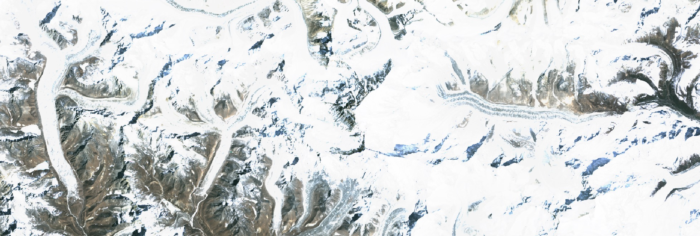

Easy Satellite API in order to do some analytics or work with satellite data. Get beautiful images for a location and date.

In order to work with the API, you need an API key. Please sign up (https://orbital-views.appspot.com) 
and check your key in your Profile. The API Key is part of your calls and identifies you.
 
HowTo:
======

Please register a field with a WKT polygon, startdate, enddate, maptype and fieldname (/api/v1/register_field/). The 'startdate' and 'enddate' should be in the following format: '2017-01-01'
A polygon can be generated with http://geojson.io/. Please mark an area of interest and save the polygon as 'WKT'. An example for a WKT string is shown in durnast.wkt.
It takes some minutes to process all requested data. Most of the API calls are based on the registered field and needs either a filename or fieldname.
You can call the /api/v1/ls/{fieldname} function in order to list all available images.
Another option would be to use the OrbitalViews GUI which has a download feature ('FieldBox').

   
