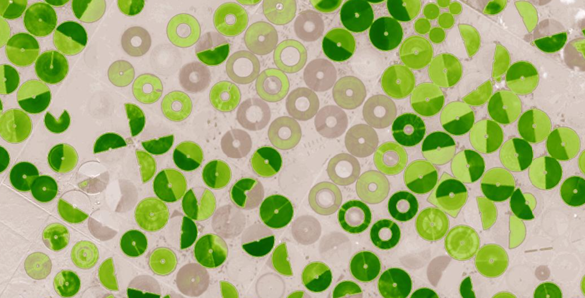

Easy Satellite API in order to do some analytics or work with satellite data. Get beautiful images for a location and date.

In order to work with the API, you need an API key. Please sign up (https://orbital-views.appspot.com) 
and check your key in your Profile. The API Key is part of your calls and identifies you.
 
HowTo:
======

Please register a field with a WKT polygon, startdate, enddate, maptype and fieldname (/api/v1/register_field/). The 'startdate' and 'enddate' should be in the following format: '2017-01-01'.
A polygon can be generated with http://geojson.io/. Please mark an area of interest and save the polygon as 'WKT'. An example for a WKT string is shown in the file 'durnast.wkt'.
It takes some minutes to process all requested data. Most of the API calls are based on registered fields and needs either a filename or fieldname.
You can call the /api/v1/ls/{fieldname} function in order to list all available images.
OrbitalViews has also a directory which lists all images and supports downloads('FieldBox').

   
Demo:
=====
The demo is based on Google EarthEngine and shows the most current Sentinel-2 image and corresponding indices. Search a location of interest and mark an area with "MyField". 
The processing of your data takes some seconds. The buttons activate a corresponding map view.
Note: This is a Desktop WebApp which was not optimized for smartphones. The water need map
incorporates weather information and visualizes water needs for yesterday.